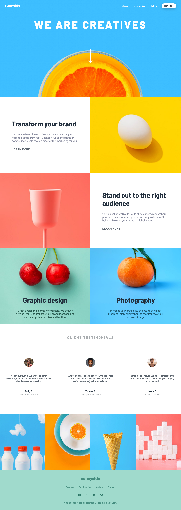
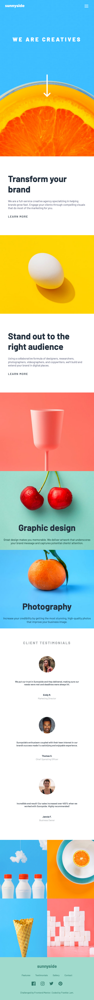

# Frontend Mentor - Sunnyside agency landing page solution

This is a solution to the [Sunnyside agency landing page challenge on Frontend Mentor](https://www.frontendmentor.io/challenges/sunnyside-agency-landing-page-7yVs3B6ef). Frontend Mentor challenges help you improve your coding skills by building realistic projects.

## Table of contents

- [Overview](#overview)
  - [The challenge](#the-challenge)
  - [Screenshot](#screenshot)
  - [Links](#links)
- [My process](#my-process)
  - [Built with](#built-with)
  - [Why I took the challenge](#why-i-took-the-challenge)
  - [What I learned](#what-i-learned)
- [Author](#author)

## Overview

### The challenge

Users should be able to:

- View the optimal layout for the site depending on their device's screen size
- See hover states for all interactive elements on the page
- See front-page revealing animation at the beginning
- See section revealing animation on scrolling

### Screenshot

## Desktop view



## Mobile view



### Links

- Solution URL: [https://github.com/frankiecflam/sunnyside-landing-page](https://github.com/frankiecflam/sunnyside-landing-page)
- Live Site URL: [https://frankie-sunnyside.netlify.app/](https://frankie-sunnyside.netlify.app/)

## My process

### Built with

- Semantic HTML5 markup
- SASS
- Flexbox
- CSS Grid
- Desktop-first workflow
- JavaScript

### Why I took the challenge

This is a coding challenge from Front-end mentor. The purpose of coding this website is to practise my HTML, CSS and a bit of JavaScript skills. The design of this website is partially different from the original, solely for the purpose of my own sense of aesthetics and also joy of testing out the features I have learnt recently.

### What I learned

#### SASS

This is my first time coding a website with the use of SASS. Throughout the project, I managed to use various features of SASS, including nesting, maxin and custom variables.

```scss
.nav { 
  &__btn { 
    @include navBtn; &-menu { @include menuBtn; } 
    } 
  }
```

#### BEM naming methodlogy

BEM naming makes my code easier to understand and manage. Before this project, I used to name elements in a casual way, thereby creating so much confusion in understanding and organising of CSS properties when projects get bigger.

```html
<header class="header">
  <h1 class="header__heading">we are creatives</h1>
  </img>
</header>
```

#### GSAP

Despite not listed as a feature requirement for the challenge, I learned from Youtube to use GSAP to do a front-page revealing animation to further enhance the interaction with users.

```js
let tl = gsap.timeline();
tl.from(".header", {
    scale: 0.5,
    duration: 1,
    opacity: 0,
    ease: Expo.Easeout,
    delay: 0.2
})
.to(".header__heading", {
    clipPath: "polygon(0 0, 100% 0, 100% 100%, 0 100%)",
    y: 0,
}, "-=0.3")
.to(".header__arrow", {
    clipPath: "polygon(0 0, 100% 0, 100% 100%, 0 100%)",
    y: 0,
})
.to("#nav__contact", {
    opacity: 1,
})
```

## Author

- Email - [Frankie Lam](cfl.frankie@gmail.com)
- Instagram - [@frankie__](https://www.instagram.com/frankie___lam/)
- Facebook - [Frankie Lam](https://www.facebook.com/frankiecflam/)